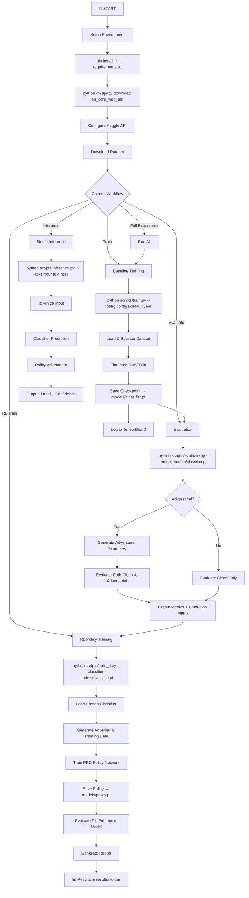
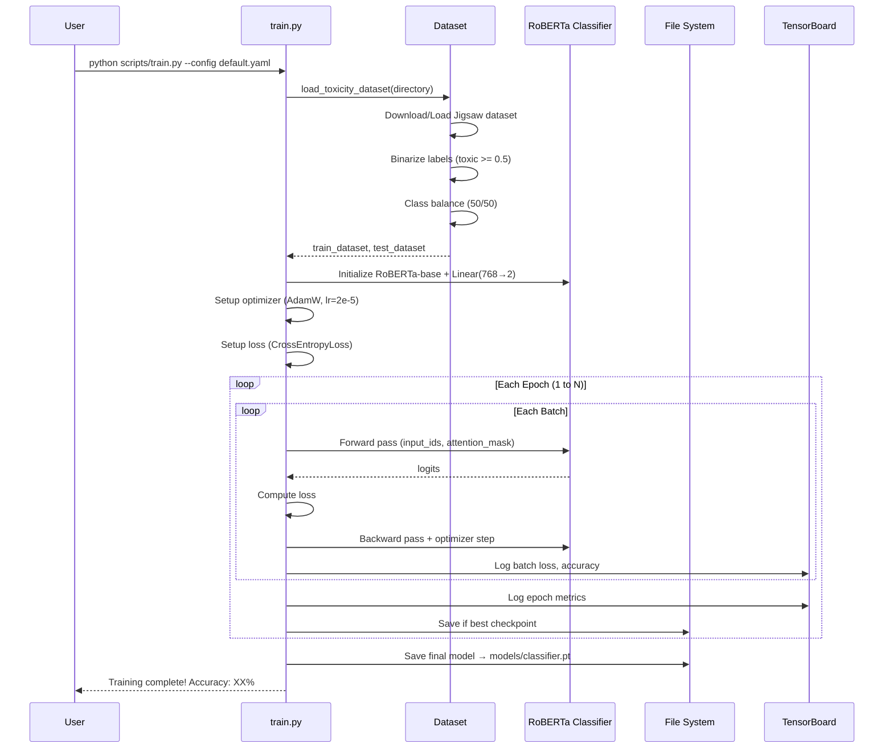
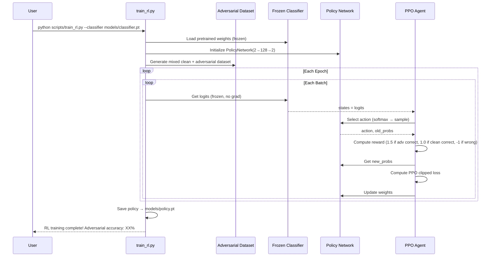
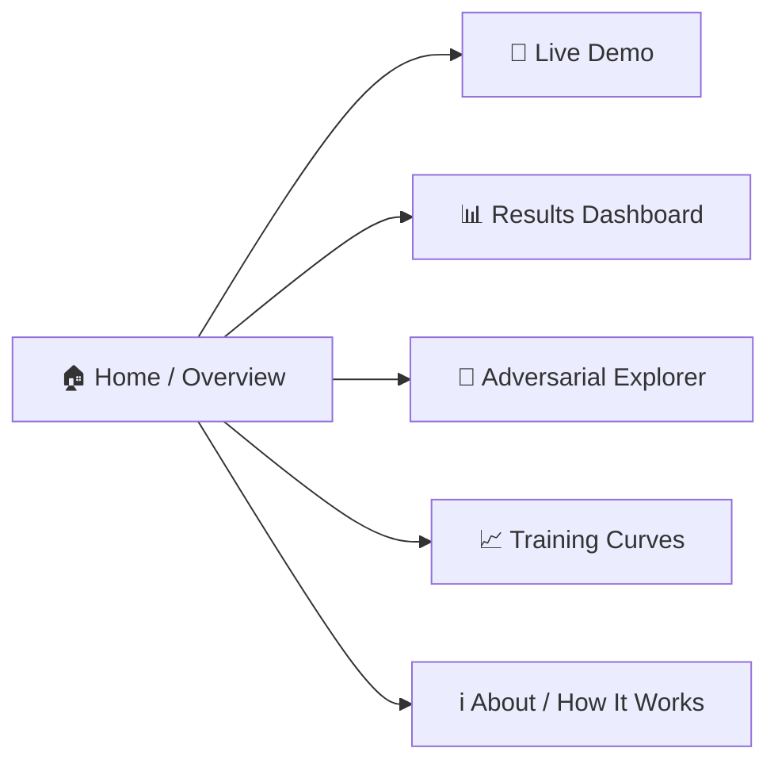
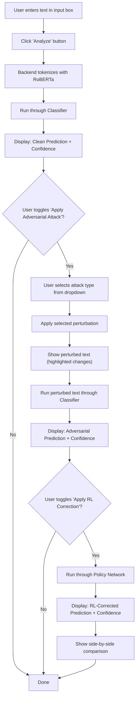
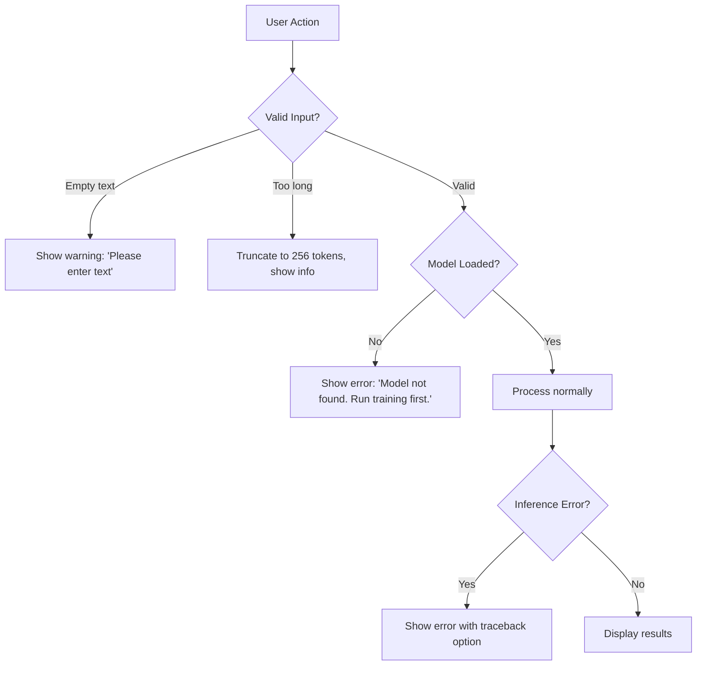
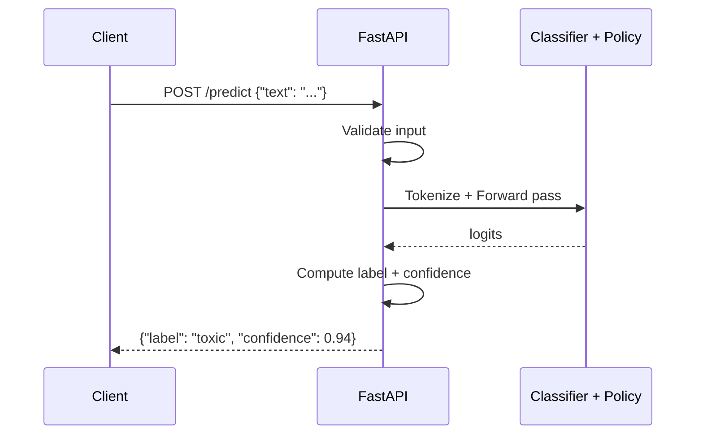

# Web / App Flow Document
# Safety Alignment Classifier — User Flows & Interaction Design

**Version:** 1.0  
**Date:** August 27, 2026  
**Author:** Lavish Bansal  

---

## 1. Application Overview

The Safety Alignment Classifier has **two interfaces**:
1. **CLI Pipeline** — For training, evaluation, and experiment management (developer-facing)
2. **Web Dashboard** — Streamlit-based interactive demo (user-facing, portfolio/resume showcase)

---

## 2. CLI Pipeline Flows

### 2.1 Complete Pipeline Flow



### 2.2 Training Flow (Detailed)



### 2.3 RL Training Flow (Detailed)



---

## 3. Web Dashboard Flows (Streamlit)

### 3.1 Application Navigation



### 3.2 Page: Home / Overview

```
┌─────────────────────────────────────────────────────────────────────┐
│  🛡️ Safety Alignment Classifier                                     │
│  Adversarially Robust Toxicity Detection with RL                     │
│                                                                      │
│  ┌────────────┐  ┌────────────┐  ┌────────────┐  ┌────────────┐   │
│  │  92.3%     │  │  58.7%     │  │  81.2%     │  │  22.5%     │   │
│  │  Clean Acc │  │  Adv. Acc  │  │  RL Acc    │  │  Recovery  │   │
│  └────────────┘  └────────────┘  └────────────┘  └────────────┘   │
│                                                                      │
│  ┌──────────────────────────────────────────────────────────────┐   │
│  │              Architecture Diagram                             │   │
│  │  [RoBERTa Classifier] → [Adversarial Attacks] → [RL Policy]  │   │
│  └──────────────────────────────────────────────────────────────┘   │
│                                                                      │
│  Quick Links: [Try Demo] [View Results] [GitHub]                     │
└─────────────────────────────────────────────────────────────────────┘
```

### 3.3 Page: Live Demo — User Flow



### 3.4 Page: Live Demo — Wireframe

```
┌─────────────────────────────────────────────────────────────────────┐
│  📝 Live Toxicity Detection Demo                                     │
│                                                                      │
│  ┌──────────────────────────────────────────────────────────────┐   │
│  │  Enter text to analyze:                                       │   │
│  │  ┌──────────────────────────────────────────────────────┐     │   │
│  │  │  This is a terrible and hateful comment about...      │     │   │
│  │  └──────────────────────────────────────────────────────┘     │   │
│  │  [🔍 Analyze]                                                 │   │
│  └──────────────────────────────────────────────────────────────┘   │
│                                                                      │
│  ┌──────────────────────┐  ┌──────────────────────┐                 │
│  │ ⚔️ Attack Type:       │  │ 🎚️ Perturbation:     │                 │
│  │ [Keyboard Typo    ▾] │  │ [████░░░░░░] 40%     │                 │
│  │ ☑ Apply Attack       │  │ ☑ Apply RL Fix       │                 │
│  └──────────────────────┘  └──────────────────────┘                 │
│                                                                      │
│  ═══════════════════════════════════════════════════════════════     │
│                                                                      │
│  ┌──────────────────┐ ┌──────────────────┐ ┌──────────────────┐    │
│  │ 🟢 Clean          │ │ 🔴 Adversarial    │ │ 🟢 RL-Corrected  │    │
│  │                  │ │                  │ │                  │    │
│  │ TOXIC            │ │ NOT TOXIC        │ │ TOXIC            │    │
│  │ Confidence: 94%  │ │ Confidence: 62%  │ │ Confidence: 87%  │    │
│  │                  │ │                  │ │                  │    │
│  │ "This is a       │ │ "Thsi si a       │ │ "Thsi si a       │    │
│  │  terrible and    │ │  terrlble adn    │ │  terrlble adn    │    │
│  │  hateful..."     │ │  haetful..."     │ │  haetful..."     │    │
│  └──────────────────┘ └──────────────────┘ └──────────────────┘    │
│                                                                      │
│  ┌──────────────────────────────────────────────────────────────┐   │
│  │ 📊 Confidence Comparison Bar Chart                            │   │
│  │  Clean:       ████████████████████████████████████░░ 94%      │   │
│  │  Adversarial: ████████████████████████░░░░░░░░░░░░░░ 62%      │   │
│  │  RL-Fixed:    █████████████████████████████████░░░░░ 87%      │   │
│  └──────────────────────────────────────────────────────────────┘   │
└─────────────────────────────────────────────────────────────────────┘
```

### 3.5 Page: Results Dashboard — Wireframe

```
┌─────────────────────────────────────────────────────────────────────┐
│  📊 Experiment Results Dashboard                                     │
│                                                                      │
│  ┌──────────────────────────────────────────────────────────────┐   │
│  │  Performance Comparison Table                                 │   │
│  │  ┌──────────────┬──────────┬──────────┬──────────┐           │   │
│  │  │ Metric       │ Clean    │ Adv.     │ RL-Fixed │           │   │
│  │  ├──────────────┼──────────┼──────────┼──────────┤           │   │
│  │  │ Accuracy     │ 92.3%    │ 58.7%    │ 81.2%    │           │   │
│  │  │ Precision    │ 91.5%    │ 55.2%    │ 79.8%    │           │   │
│  │  │ Recall       │ 93.1%    │ 62.3%    │ 82.6%    │           │   │
│  │  │ F1-Score     │ 92.3%    │ 58.5%    │ 81.2%    │           │   │
│  │  └──────────────┴──────────┴──────────┴──────────┘           │   │
│  └──────────────────────────────────────────────────────────────┘   │
│                                                                      │
│  ┌───────────────────────────┐  ┌───────────────────────────┐      │
│  │  Confusion Matrix (Clean) │  │ Confusion Matrix (Adv.)   │      │
│  │   ┌─────┬─────┐          │  │   ┌─────┬─────┐           │      │
│  │   │ 462 │  38 │          │  │   │ 312 │ 188 │           │      │
│  │   ├─────┼─────┤          │  │   ├─────┼─────┤           │      │
│  │   │  35 │ 465 │          │  │   │ 225 │ 275 │           │      │
│  │   └─────┴─────┘          │  │   └─────┴─────┘           │      │
│  └───────────────────────────┘  └───────────────────────────┘      │
│                                                                      │
│  ┌──────────────────────────────────────────────────────────────┐   │
│  │  Per-Attack Robustness Breakdown                              │   │
│  │  Keyboard Typo:    ████████████████████░░░░ 78%               │   │
│  │  Char Insertion:   █████████████████████░░░ 82%               │   │
│  │  Synonym Replace:  ██████████████░░░░░░░░░░ 55%               │   │
│  │  Homophone Swap:   ███████████████████░░░░░ 74%               │   │
│  │  Word Shuffle:     ████████████████░░░░░░░░ 65%               │   │
│  │  Back Translation: ██████████████████░░░░░░ 70%               │   │
│  └──────────────────────────────────────────────────────────────┘   │
└─────────────────────────────────────────────────────────────────────┘
```

### 3.6 Page: Adversarial Explorer

```
┌─────────────────────────────────────────────────────────────────────┐
│  🔬 Adversarial Text Explorer                                       │
│                                                                      │
│  Original Text:                                                      │
│  ┌──────────────────────────────────────────────────────────────┐   │
│  │  "You are such a terrible person and I hate everything       │   │
│  │   you stand for in this world."                               │   │
│  └──────────────────────────────────────────────────────────────┘   │
│                                                                      │
│  [Generate All Attacks]                                              │
│                                                                      │
│  ┌──────────────────────────────────────────────────────────────┐   │
│  │ Attack: Keyboard Typo                                         │   │
│  │ "You are suxh a terribke person and I hatr everything..."     │   │
│  │ Changed: 3 words | Classifier: NOT TOXIC (❌ fooled!)         │   │
│  ├──────────────────────────────────────────────────────────────┤   │
│  │ Attack: Synonym Replacement                                   │   │
│  │ "You are such a awful individual and I detest everything..."  │   │
│  │ Changed: 3 words | Classifier: TOXIC (✅ detected!)           │   │
│  ├──────────────────────────────────────────────────────────────┤   │
│  │ Attack: Homophone Substitution                                │   │
│  │ "You are such a terrible person and I hate everything..."     │   │
│  │ Changed: 0 words | Classifier: TOXIC (✅ detected!)           │   │
│  ├──────────────────────────────────────────────────────────────┤   │
│  │ Attack: Word Order Shuffle                                    │   │
│  │ "Are you such a terrible person and hate I everything..."     │   │
│  │ Changed: reordered | Classifier: NOT TOXIC (❌ fooled!)       │   │
│  └──────────────────────────────────────────────────────────────┘   │
└─────────────────────────────────────────────────────────────────────┘
```

---

## 4. State Management

### 4.1 Application State (Streamlit)

```python
# Session state structure
st.session_state = {
    # Models (loaded once)
    "classifier": ToxicityClassifier,      # Loaded model
    "policy": PolicyNetwork,               # Loaded policy
    "tokenizer": RobertaTokenizer,         # Shared tokenizer
    
    # User inputs
    "input_text": str,                     # Current input text
    "attack_type": str,                    # Selected attack
    "perturbation_prob": float,            # Attack strength
    "apply_attack": bool,                  # Toggle
    "apply_rl": bool,                      # Toggle
    
    # Results
    "clean_prediction": dict,              # {label, confidence, logits}
    "adversarial_prediction": dict,        # {label, confidence, logits, perturbed_text}
    "rl_prediction": dict,                 # {label, confidence, adjusted_logits}
    
    # Experiment results
    "results_df": pd.DataFrame,            # Pre-computed results table
    "confusion_matrices": dict,            # Pre-computed confusion matrices
}
```

### 4.2 Error Handling Flow



---

## 5. API Endpoints (Future — FastAPI)

### 5.1 Endpoint Design

| Method | Endpoint | Description | Request Body | Response |
|--------|----------|-------------|-------------|----------|
| POST | `/predict` | Single text classification | `{"text": str}` | `{"label": str, "confidence": float, "logits": [float]}` |
| POST | `/predict/batch` | Batch classification | `{"texts": [str]}` | `[{"label": str, "confidence": float}]` |
| POST | `/predict/adversarial` | Predict with adversarial analysis | `{"text": str, "attack": str}` | `{"clean": {...}, "adversarial": {...}, "rl_corrected": {...}}` |
| GET | `/health` | Health check | — | `{"status": "ok", "model_loaded": bool}` |
| GET | `/attacks` | List available attacks | — | `{"attacks": [str]}` |

### 5.2 API Flow



---

## 6. Navigation & Routing

### 6.1 Streamlit Sidebar Navigation

```
┌───────────────────┐
│ 🛡️ SAC Dashboard   │
│                   │
│ ─────────────────│
│                   │
│ 🏠 Overview       │
│ 📝 Live Demo      │
│ 📊 Results        │
│ 🔬 Adv. Explorer  │
│ 📈 Training Logs  │
│ ℹ️ About          │
│                   │
│ ─────────────────│
│                   │
│ Model Status:     │
│ ✅ Classifier     │
│ ✅ Policy Net     │
│                   │
│ Device: GPU       │
│ Latency: ~50ms    │
└───────────────────┘
```

---

## 7. Deployment Options

### 7.1 Local Development
```bash
streamlit run app/streamlit_app.py --server.port 8501
```

### 7.2 Cloud Deployment Options

| Platform | Free Tier | GPU Support | Notes |
|----------|-----------|-------------|-------|
| **Streamlit Cloud** | ✅ (1 app) | ❌ | Best for portfolio demo; CPU only |
| **HuggingFace Spaces** | ✅ | ✅ (paid) | Gradio integration native |
| **Render** | ✅ | ❌ | Docker support |
| **Google Colab** | ✅ | ✅ | Great for notebooks |
| **AWS EC2** | Free tier | ✅ (paid) | Full control |

### 7.3 Recommended: Streamlit Cloud + HuggingFace Spaces
- Deploy **Streamlit app** on Streamlit Cloud for the interactive demo
- Upload **model weights** to HuggingFace Hub for easy loading
- Add a "Live Demo" badge to README and resume
