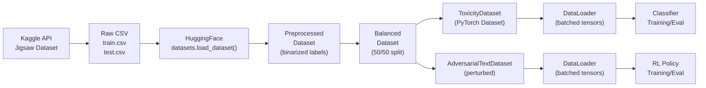

# Data Schema Document
# Safety Alignment Classifier — Data Models & Schemas

**Version:** 1.0  
**Date:** August 27, 2026  
**Author:** Lavish Bansal  

---

## 1. Data Flow Architecture



---

## 2. Raw Data Schema (Jigsaw Dataset)

### 2.1 Training Data (`train.csv`)

| Column | Type | Description | Example |
|--------|------|-------------|---------|
| `id` | string | Unique comment identifier | `"0000997932d777bf"` |
| `comment_text` | string | Raw comment text (English) | `"This is a comment..."` |
| `toxic` | float [0, 1] | Toxicity score | `0.0` or `1.0` |
| `severe_toxic` | float [0, 1] | Severe toxicity score | `0.0` |
| `obscene` | float [0, 1] | Obscenity score | `1.0` |
| `threat` | float [0, 1] | Threat score | `0.0` |
| `insult` | float [0, 1] | Insult score | `1.0` |
| `identity_hate` | float [0, 1] | Identity hate score | `0.0` |

**Statistics:**
- Total rows: ~160,000 (training)
- Class distribution: ~90% non-toxic, ~10% toxic (imbalanced)
- Average comment length: ~394 characters
- Max comment length: ~5,000 characters

### 2.2 Test Data (`test.csv`)

| Column | Type | Description |
|--------|------|-------------|
| `id` | string | Unique comment identifier |
| `comment_text` | string | Raw comment text |

### 2.3 Test Labels (`test_labels.csv`)

| Column | Type | Description |
|--------|------|-------------|
| `id` | string | Matches test.csv |
| `toxic` | int {-1, 0, 1} | -1 = not evaluated |
| `severe_toxic` | int {-1, 0, 1} | Same encoding |
| `obscene` | int {-1, 0, 1} | Same encoding |
| `threat` | int {-1, 0, 1} | Same encoding |
| `insult` | int {-1, 0, 1} | Same encoding |
| `identity_hate` | int {-1, 0, 1} | Same encoding |

---

## 3. Preprocessed Data Schema

### 3.1 After `preprocess_function()`

```python
# Transformation:
# example["label"] = 1 if example["toxic"] >= 0.5 else 0

# Result: Binary label added to each example
{
    "id": str,
    "comment_text": str,
    "toxic": float,
    "severe_toxic": float,
    "obscene": float,
    "threat": float,
    "insult": float,
    "identity_hate": float,
    "label": int  # NEW: 0 (non-toxic) or 1 (toxic)
}
```

### 3.2 After Class Balancing

```python
# Balanced dataset: equal number of toxic (1) and non-toxic (0) samples
# Default: 5000 total → 2500 toxic + 2500 non-toxic (training)
#          1000 total → 500 toxic + 500 non-toxic (test)

# Schema unchanged, but distribution is now 50/50
```

---

## 4. PyTorch Dataset Schemas

### 4.1 ToxicityDataset (Clean Data)

```python
class ToxicityDataset:
    """Clean text toxicity dataset for baseline training/evaluation."""
    
    # __getitem__ return schema:
    {
        "text": str,                    # Original comment text
        "input_ids": torch.Tensor,      # Shape: [256], dtype: torch.long
                                        # RoBERTa tokenized input IDs
        "attention_mask": torch.Tensor, # Shape: [256], dtype: torch.long
                                        # 1 for real tokens, 0 for padding
        "label": torch.Tensor,          # Shape: [], dtype: torch.long
                                        # 0 (non-toxic) or 1 (toxic)
        "is_adversarial": torch.Tensor  # Shape: [], dtype: torch.bool
                                        # Always False for clean dataset
    }
```

**Tensor Specifications:**

| Field | Shape | Dtype | Range | Notes |
|-------|-------|-------|-------|-------|
| `input_ids` | `[256]` | `torch.long` | `[0, 50264]` | RoBERTa vocab size = 50,265 |
| `attention_mask` | `[256]` | `torch.long` | `{0, 1}` | 1 = real token, 0 = padding |
| `label` | `[]` (scalar) | `torch.long` | `{0, 1}` | Binary classification |
| `is_adversarial` | `[]` (scalar) | `torch.bool` | `{False}` | Always False |

### 4.2 AdversarialTextDataset (Perturbed Data)

```python
class AdversarialTextDataset:
    """Adversarially perturbed text dataset for robustness evaluation/training."""
    
    # __getitem__ return schema:
    {
        "text": str,                    # Perturbed comment text (after attacks)
        "input_ids": torch.Tensor,      # Shape: [256], dtype: torch.long
        "attention_mask": torch.Tensor, # Shape: [256], dtype: torch.long
        "label": torch.Tensor,          # Shape: [], dtype: torch.long
                                        # Original label (unchanged by attack)
        "is_adversarial": torch.Tensor  # Shape: [], dtype: torch.bool
                                        # True if this sample was perturbed
    }
```

**Key Difference from Clean:**
- `text` contains the perturbed version (may differ from original)
- `is_adversarial` can be True or False (mixed dataset)
- `label` is preserved from the original (ground truth doesn't change)

### 4.3 DataLoader Batch Schema

```python
# After DataLoader batching:
batch = {
    "text": List[str],                    # Length: batch_size
    "input_ids": torch.Tensor,            # Shape: [batch_size, 256]
    "attention_mask": torch.Tensor,       # Shape: [batch_size, 256]
    "label": torch.Tensor,                # Shape: [batch_size]
    "is_adversarial": torch.Tensor        # Shape: [batch_size]
}
```

---

## 5. Model Input/Output Schemas

### 5.1 ToxicityClassifier

```python
class ToxicityClassifier(nn.Module):
    """RoBERTa-based binary toxicity classifier."""
    
    # Input:
    #   input_ids:      torch.Tensor [batch_size, 256]  (torch.long)
    #   attention_mask: torch.Tensor [batch_size, 256]  (torch.long)
    
    # Output:
    #   logits:         torch.Tensor [batch_size, 2]    (torch.float32)
    #                   logits[i][0] = non-toxic score
    #                   logits[i][1] = toxic score
    
    # Internal architecture:
    #   RoBERTa(input_ids, attention_mask)
    #     → pooler_output [batch_size, 768]
    #     → Dropout(0.3)
    #     → Linear(768, 2)
    #     → logits [batch_size, 2]
```

**Layer Dimensions:**

| Layer | Input Shape | Output Shape | Parameters |
|-------|------------|--------------|------------|
| RoBERTa Encoder | `[B, 256]` × 2 | `[B, 256, 768]` | ~125M |
| Pooler (CLS) | `[B, 256, 768]` | `[B, 768]` | ~590K |
| Dropout | `[B, 768]` | `[B, 768]` | 0 |
| Linear (classifier head) | `[B, 768]` | `[B, 2]` | 1,538 |
| **Total** | | | **~125.6M** |

### 5.2 PolicyNetwork

```python
class PolicyNetwork(nn.Module):
    """RL policy network that adjusts classifier logits."""
    
    # Input:
    #   x (states): torch.Tensor [batch_size, 2]  (torch.float32)
    #               These are the classifier's logits
    
    # Output:
    #   logits:     torch.Tensor [batch_size, 2]  (torch.float32)
    #               Policy adjustments to add to classifier logits
    
    # Internal architecture:
    #   Linear(2, 128) → ReLU → Linear(128, 2)
```

**Layer Dimensions:**

| Layer | Input Shape | Output Shape | Parameters |
|-------|------------|--------------|------------|
| Linear (fc1) | `[B, 2]` | `[B, 128]` | 384 |
| ReLU | `[B, 128]` | `[B, 128]` | 0 |
| Linear (fc2) | `[B, 128]` | `[B, 2]` | 258 |
| **Total** | | | **642** |

### 5.3 Combined Inference (Classifier + Policy)

```python
# Combined inference pipeline:
#
# Step 1: Classifier forward pass
#   logits = classifier(input_ids, attention_mask)  # [B, 2]
#
# Step 2: Policy adjustment
#   adjustments = policy(logits)                     # [B, 2]
#
# Step 3: Combine
#   adjusted_logits = logits + adjustments           # [B, 2]
#
# Step 4: Predict
#   predictions = adjusted_logits.argmax(dim=-1)     # [B]
```

---

## 6. Adversarial Perturbation Schemas

### 6.1 Perturbation Configuration

```python
# Per-sample perturbation configuration:
{
    "transform_prob": float,           # Overall probability of applying each attack
                                       # Range: [0.0, 1.0], default: 0.3-0.4
    "apply_back_translation": bool,    # Whether to use back-translation (slow)
    "fully_adversarial": bool          # If True, all samples are perturbed
                                       # If False, ~50% samples are perturbed
}
```

### 6.2 Keyboard Map Schema

```python
KEYBOARD_MAP: Dict[str, str] = {
    # Key → adjacent keys on QWERTY layout
    'q': 'qw', 'w': 'weq', 'e': 'wer', 'r': 'ret',
    't': 'tyr', 'y': 'ytu', 'u': 'uio', 'i': 'iop',
    'o': 'op', 'p': 'plo', 'a': 'as', 's': 'sad',
    # ... (lowercase only)
}
```

### 6.3 Homophone Map Schema

```python
HOMOPHONE_MAP: Dict[str, str] = {
    # word → homophone replacement
    'to': 'too', 'too': 'two', 'there': 'their',
    'their': "they're", 'hear': 'here', 'where': 'wear',
    'know': 'no', 'new': 'knew', 'right': 'write', 'bare': 'bear'
}
# NOTE: Very limited dictionary — should be expanded for better coverage
```

---

## 7. Training State Schemas

### 7.1 Model Checkpoint (`.pt` file)

```python
# Current (simple):
torch.save(model.state_dict(), model_path)

# Proposed (comprehensive):
checkpoint = {
    "model_state_dict": model.state_dict(),    # OrderedDict of tensors
    "optimizer_state_dict": optimizer.state_dict(),
    "epoch": int,                               # Current epoch
    "best_metric": float,                       # Best accuracy/F1
    "config": {                                 # Training configuration
        "model_name": str,                      # "roberta-base"
        "learning_rate": float,
        "epochs": int,
        "batch_size": int,
        "dataset_size": int,
        "max_length": int,
        "dropout": float,
    },
    "metrics": {                                # Final metrics
        "train_accuracy": float,
        "train_loss": float,
        "val_accuracy": float,
        "val_f1": float,
    },
    "timestamp": str,                           # ISO format datetime
}
torch.save(checkpoint, model_path)
```

### 7.2 PPO Training State

```python
# PPO Agent state:
{
    "policy_state_dict": policy_network.state_dict(),
    "optimizer_state_dict": optimizer.state_dict(),
    "classifier_path": str,                    # Path to frozen classifier
    "epsilon": float,                          # PPO clipping parameter
    "epoch": int,
    "metrics": {
        "total_reward": float,
        "policy_loss": float,
        "adversarial_accuracy": float,
        "clean_accuracy": float,
    },
}
```

---

## 8. Evaluation Output Schemas

### 8.1 Metrics Report

```python
# Per-evaluation output:
metrics_report = {
    "evaluation_type": str,            # "clean" | "adversarial" | "rl_enhanced"
    "dataset_size": int,
    "timestamp": str,
    "metrics": {
        "accuracy": float,             # [0, 1]
        "precision": float,            # [0, 1]
        "recall": float,               # [0, 1]
        "f1_score": float,             # [0, 1]
        "auc_roc": float,              # [0, 1]  (proposed)
    },
    "confusion_matrix": {
        "true_positives": int,
        "true_negatives": int,
        "false_positives": int,
        "false_negatives": int,
    },
    "per_attack_metrics": {            # Only for adversarial evaluation
        "keyboard_typo": {"accuracy": float, "f1": float},
        "char_insertion": {"accuracy": float, "f1": float},
        "synonym_replacement": {"accuracy": float, "f1": float},
        "homophone_substitution": {"accuracy": float, "f1": float},
        "word_order_shuffle": {"accuracy": float, "f1": float},
        "back_translation": {"accuracy": float, "f1": float},
    },
}
```

### 8.2 Comparative Results Table

```python
# Final results comparison:
results_table = {
    "model": str,                      # "RoBERTa-base"
    "comparisons": [
        {
            "scenario": "clean",
            "accuracy": float,
            "precision": float,
            "recall": float,
            "f1": float,
        },
        {
            "scenario": "adversarial",
            "accuracy": float,
            "precision": float,
            "recall": float,
            "f1": float,
        },
        {
            "scenario": "rl_enhanced",
            "accuracy": float,
            "precision": float,
            "recall": float,
            "f1": float,
        },
    ],
}
```

---

## 9. Configuration Schema (Proposed YAML)

```yaml
# configs/default.yaml
experiment:
  name: "safety-alignment-baseline"
  seed: 42
  device: "auto"  # "auto", "cuda", "cpu"

data:
  directory: "./jigsaw_toxicity_data"
  train_size: 5000
  test_size: 1000
  max_length: 256
  class_balancing: true
  batch_size: 32

model:
  name: "roberta-base"
  dropout: 0.3
  num_classes: 2

training:
  epochs: 3
  learning_rate: 2.0e-5
  optimizer: "adamw"
  weight_decay: 0.01
  scheduler: null  # "cosine", "linear", null
  early_stopping_patience: 5
  save_best: true

adversarial:
  transform_prob: 0.4
  apply_back_translation: false
  attacks:
    - keyboard_typo
    - char_insertion
    - synonym_replacement
    - homophone_substitution
    - word_order_shuffle

rl:
  epochs: 4
  learning_rate: 3.0e-4
  epsilon: 0.2
  optimizer: "adam"
  reward_correct: 1.0
  reward_adversarial_correct: 1.5
  reward_incorrect: -1.0

evaluation:
  generate_confusion_matrix: true
  generate_roc_curve: true
  per_attack_breakdown: true
  save_predictions: true

logging:
  tensorboard: true
  log_dir: "./results/logs"
  log_every_n_steps: 10

paths:
  classifier_model: "./models/classifier.pt"
  policy_model: "./models/policy.pt"
  results_dir: "./results"
  figures_dir: "./results/figures"
```

---

## 10. API Schemas (Future FastAPI)

### 10.1 Request Schemas

```python
from pydantic import BaseModel, Field
from typing import Optional, List
from enum import Enum

class AttackType(str, Enum):
    KEYBOARD_TYPO = "keyboard_typo"
    CHAR_INSERTION = "char_insertion"
    SYNONYM_REPLACEMENT = "synonym_replacement"
    HOMOPHONE_SUBSTITUTION = "homophone_substitution"
    WORD_ORDER_SHUFFLE = "word_order_shuffle"
    BACK_TRANSLATION = "back_translation"
    ALL = "all"

class PredictionRequest(BaseModel):
    text: str = Field(..., min_length=1, max_length=5000)
    apply_rl: bool = False

class AdversarialPredictionRequest(BaseModel):
    text: str = Field(..., min_length=1, max_length=5000)
    attack_type: AttackType = AttackType.KEYBOARD_TYPO
    perturbation_prob: float = Field(0.4, ge=0.0, le=1.0)
    apply_rl: bool = True

class BatchPredictionRequest(BaseModel):
    texts: List[str] = Field(..., min_items=1, max_items=100)
    apply_rl: bool = False
```

### 10.2 Response Schemas

```python
class PredictionResponse(BaseModel):
    label: str                  # "toxic" or "non-toxic"
    label_id: int               # 0 or 1
    confidence: float           # Softmax probability [0, 1]
    logits: List[float]         # Raw logits [non-toxic, toxic]
    processing_time_ms: float   # Inference latency

class AdversarialPredictionResponse(BaseModel):
    original_text: str
    perturbed_text: str
    attack_type: str
    words_changed: int
    clean_prediction: PredictionResponse
    adversarial_prediction: PredictionResponse
    rl_corrected_prediction: Optional[PredictionResponse]

class HealthResponse(BaseModel):
    status: str                 # "ok" or "error"
    classifier_loaded: bool
    policy_loaded: bool
    device: str                 # "cuda" or "cpu"
    model_version: str
```

---

## 11. File System Schema

```
jigsaw_toxicity_data/                  # Downloaded dataset
├── train.csv                          # ~160K rows, ~160MB
├── test.csv                           # ~150K rows, ~150MB
├── test_labels.csv                    # ~150K rows, ~5MB
└── sample_submission.csv              # Template

models/                                # Saved checkpoints
├── classifier.pt                      # ~500MB (RoBERTa + head)
├── classifier_best.pt                 # Best checkpoint
├── policy.pt                          # ~3KB (2-layer MLP)
└── training_history.json              # Metrics per epoch

results/                               # Experiment outputs
├── figures/
│   ├── confusion_matrix_clean.png
│   ├── confusion_matrix_adversarial.png
│   ├── confusion_matrix_rl.png
│   ├── metrics_comparison.png
│   ├── training_curves.png
│   ├── per_attack_robustness.png
│   └── roc_curves.png
├── tables/
│   ├── results_summary.csv
│   └── per_attack_breakdown.csv
└── logs/
    └── tensorboard/
        ├── events.out.tfevents.*
        └── ...
```
